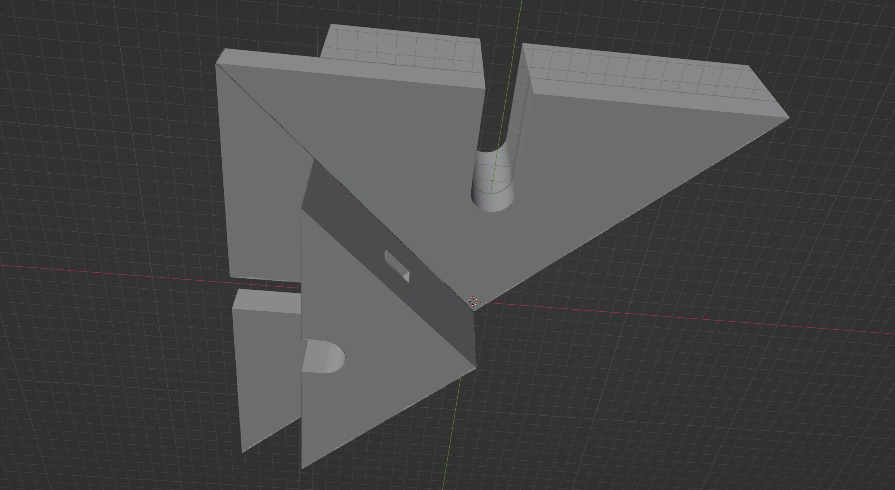

# Build
```bash
$ make
ln -s distox.scad part_1.scad
ln -s distox.scad part_1_1.scad
ln -s distox.scad part_1_2.scad
ln -s distox.scad part_2.scad
ln -s distox.scad part_2_1.scad
ln -s distox.scad part_2_2.scad
ln -s distox.scad part_3.scad
ln -s distox.scad part_3_1.scad
ln -s distox.scad part_3_2.scad
ln -s distox.scad all_parts.scad
```

```bash
$ make build
openscad -q -o "part_1.stl" -p parameters.json -P part_1  "part_1.scad"
openscad -q -o "part_1_1.stl" -p parameters.json -P part_1_1  "part_1_1.scad"
openscad -q -o "part_1_2.stl" -p parameters.json -P part_1_2  "part_1_2.scad"
openscad -q -o "part_2.stl" -p parameters.json -P part_2  "part_2.scad"
openscad -q -o "part_2_1.stl" -p parameters.json -P part_2_1  "part_2_1.scad"
openscad -q -o "part_2_2.stl" -p parameters.json -P part_2_2  "part_2_2.scad"
openscad -q -o "part_3.stl" -p parameters.json -P part_3  "part_3.scad"
openscad -q -o "part_3_1.stl" -p parameters.json -P part_3_1  "part_3_1.scad"
openscad -q -o "part_3_2.stl" -p parameters.json -P part_3_2  "part_3_2.scad"
openscad -q -o "all_parts.stl" -p parameters.json -P all_parts  "all_parts.scad"
```

# Captures

## Complete Object with Blender


## Complete Object with OpenSCAD


## Object Part 1, with second part hidden



## Object Part 2, with second part hidden


## Object Part 3, with second part hidden


# Details

## part_1.stl

part_1 uncut.

## part_1_1.stl

part 1 cut out, first part with notch for easy assembly.

## part_1_2.stl

part 1 cut out, second part with notch for easy assembly.

## part_2.stl

part_2 uncut.

## part_2_1.stl

part 2 cut out, first part with notch for easy assembly.

## part_2_2.stl

part 2 cut out, second part with notch for easy assembly.

## part_3.stl

part_3 uncut.

## part_3_1.stl

part 3 cut out, first part with notch for easy assembly.

## part_3_2.stl

part 3 cut out, second part with notch for easy assembly.

## all_parts.stl

complete assembled object
